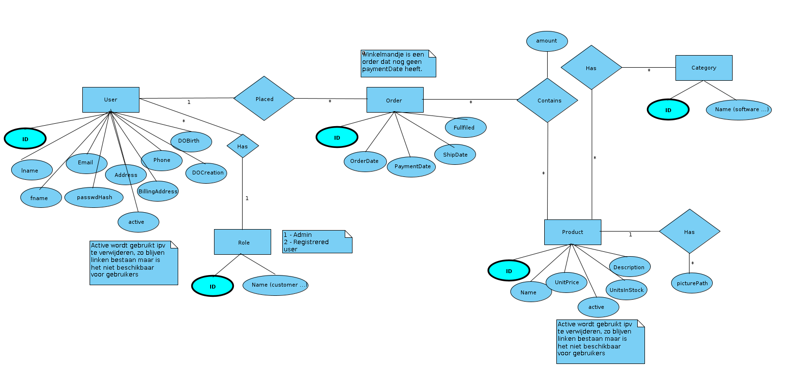
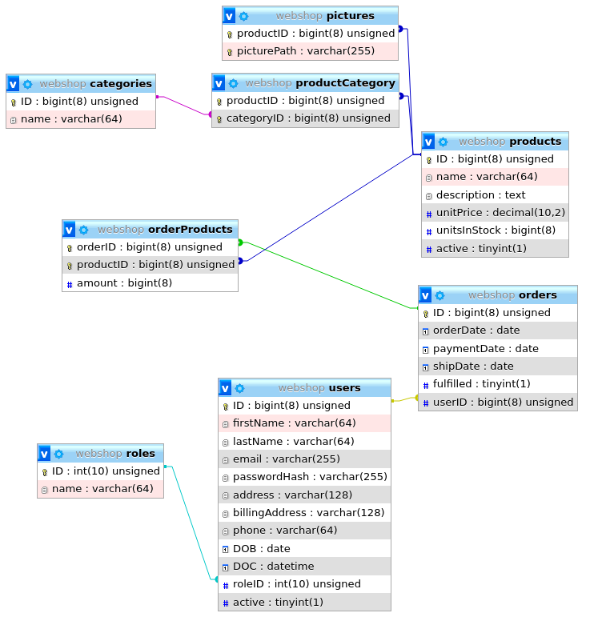

Peter Leconte 2AD1 r0830684

# Webshop PHP & MySQL

## Important note!

Since I use docker the hostname for the database is ***not*** `localhost` but `database` instead.  
You need to change the default value to your hostname in file `webshop/include/class/db.php`.

```php
public function __construct(
  $p_host = "database", // <- Change here! Line 17
```

- SQL dump is in `webshop/SQL/webshop.sql`
- This website was developed in Firefox, quickly checked in Chromium.
- Table `pictures` in SQL supports multiple pictures for one product. I did this for future proofing but ended up just always taking the first picture.
  
**Some dummy accounts:**
  
| E-mail | Password | Role |
|---|---|---|
| peter5leconte@gmail.com | test1234 | admin |
| example@email.com | test1234 | normal user |
| test@gmail.com | TEST1234 | admin |
| test@test.com | test1234 | normal user |

The admin panel can be found at `admin.php` or by clicking on your name in the navbar and clicking `Admin panel`.

## Checklist

### Hand-in

- [X] Your webshop
  - Everything in this root folder
- [X] SQL file to load database
  - `webshop/SQL/webshop.sql` SQL dump
- [X] ER diagram
  - webshop/ERD.png
    - 
  - webshop/phpmyadmin_diagram.png
    - 

### Features

- [X] Gewone gebruiker
  - [X] Kan minstens 1 site bekijken
  - [X] Kan producten zien
    - [X] Kan weergave veranderen (filter) mbv AJAX
  - [X] Kan zich registreren
    - [X] Controleer met JS
    - [X] Geen dubbele registraties
  - [X] Heeft geen toegang tot sites van geregistreerde gebruikers en administrators
- [X] Geregistreerde gebruiker
  - [X] Kan zich inloggen/uitloggen
  - [X] Kan producten aan winkelmandje toevoegen
  - [X] Bestelling plaatsen
  - [X] Bestelling moet in databank opgeslagen worden
    - [X] Betalen moet niet echt gebeuren, maar wel in database registreerd worden
  - [X] Heeft geen toegang tot admin sites
- [X] Administrators
  - [X] Mogelijkheid voor meerdere admins
  - [X] Database inhoud aanpassen
    - [X] Gebruikers
      - [X] Toevoegen/verwijderen
        - Verwijderen is deactivate. Hierdoor blijven linken bestaan en kunnen ze later nog geheractiveerd worden.
      - [X] Rechten aanpassen
    - [X] Producten aanpassen/verwijderen/toevoegen
      - Verwijderen is deactivate. Hierdoor blijven linken bestaan en kunnen ze later nog geheractiveerd worden.
  - [X] Zorg voor een duidelijk interface (admin moet het kunnen gebruiken zonder kennis database/php)

### Technical requirements

- [X] HTML5 output is 100% valid ([validator](https://validator.w3.org/#validate_by_input))
  - [X] Navbar
    - [X] Admin
    - [X] User
    - [X] Logged out
  - [X] admin
  - [X] manage
    - [X] products
    - [X] cats
    - [X] users
  - [X] cart
  - [X] index
  - [X] login
  - [X] products
  - [X] profile
  - [X] register
- [X] Gebruik css reset
- [X] Enkel external css
- [X] Database
  - [X] Correcte opbouw -> geen herhaling van gegevens etc
  - [X] ER diagram
  - [X] User 'Webuser' met wachtwoord 'Lab2021' dat *enkel* vereiste perms heeft
- [X] Error handling
  - [X] Formulieren en bewerkingen mogen geen crash veroorzaken
    - [X] Verdachte/verboden acties opvangen
  - [X] Loggen in file
    - `logs/errors.log`
  - [X] Gebruik toplevel error handler en toplevel exception handler
    - `include/errors.php`
  - [X] Minstens 1 try-catch
- [X] Geen HTML/SQL injectie
  - Hopelijk toch niet ergens vergeten :) (DB class gebruikt prepare, uitzonderingen hebben sqli escape functie of worden gecast. Uit database -> htmlspecialchars)
- [X] 3 groepen (gewone, geregistreerde, admins) met toegang tot verschillende delen
- [X] Gebruik functies waar mogelijk
- [X] Gebruik minstens 1 JOIN

## SQL

SQL dump is available in `webshop/SQL/webshop.sql`.

### Table creation

```sql
USE webshop;

CREATE TABLE roles (
    ID int unsigned AUTO_INCREMENT,
    name varchar(64) NOT NULL,
  	PRIMARY KEY (ID)
);

CREATE TABLE users (
    ID bigint(8) unsigned AUTO_INCREMENT,
    firstName varchar(64) NOT NULL,
    lastName varchar(64) NOT NULL,
    email varchar(255) NOT NULL,
    passwordHash varchar(255) NOT NULL,
    address varchar(128) NOT NULL,
    billingAddress varchar(128),
    phone varchar(64),
    DOB date,
    DOC DATETIME NOT NULL DEFAULT CURRENT_TIMESTAMP,
    roleID int unsigned NOT NULL,
    active TINYINT(1) default 1 NOT NULL,
  	PRIMARY KEY (ID),
    FOREIGN KEY (roleID) REFERENCES roles(ID)
);

CREATE TABLE products (
    ID bigint(8) unsigned AUTO_INCREMENT,
    name varchar(64) NOT NULL,
    description TEXT(2000) NOT NULL,
    unitPrice DECIMAL(10,2) NOT NULL,
    unitsInStock bigint(8) NOT NULL,
    active TINYINT(1) default 1 NOT NULL,
  	PRIMARY KEY (ID)
);

CREATE TABLE categories (
    ID bigint(8) unsigned AUTO_INCREMENT,
    name varchar(64) NOT NULL,
  	PRIMARY KEY (ID)
);

CREATE TABLE productCategory (
    productID bigint(8) unsigned NOT NULL,
    categoryID bigint(8) unsigned NOT NULL,
  	PRIMARY KEY (productID, categoryID),
    FOREIGN KEY (productID) REFERENCES products(ID),
	FOREIGN KEY (categoryID) REFERENCES categories(ID)
);

CREATE TABLE orders (
    ID bigint(8) unsigned AUTO_INCREMENT,
    orderDate date default NULL,
    paymentDate date default NULL,
	  shipDate date default NULL,
    fulfilled TINYINT(1) default 0,
    userID bigint(8) unsigned NOT NULL,
  	PRIMARY KEY (ID),
    FOREIGN KEY (userID) REFERENCES users(ID)
);

CREATE TABLE orderProducts (
    orderID bigint(8) unsigned NOT NULL,
    productID bigint(8) unsigned NOT NULL,
	  amount bigint(8) default 1,
  	PRIMARY KEY (orderID, productID),
    FOREIGN KEY (orderID) REFERENCES orders(ID),
    FOREIGN KEY (productID) REFERENCES products(ID)
);

CREATE TABLE pictures (
    productID bigint(8) unsigned NOT NULL,
	  picturePath varchar(255) NOT NULL,
  	PRIMARY KEY (productID, picturePath),
    FOREIGN KEY (productID) REFERENCES products(ID)
);
```

### Insert basic data

```sql
-- User roles
INSERT INTO roles (ID, name) VALUES (1, 'admin');
INSERT INTO roles (ID, name) VALUES (2, 'registered user');
-- A normal visitor is not included, not necessary because no account
```